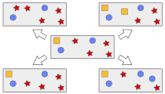
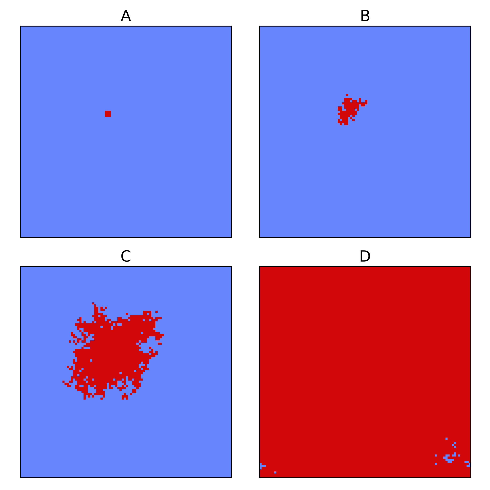
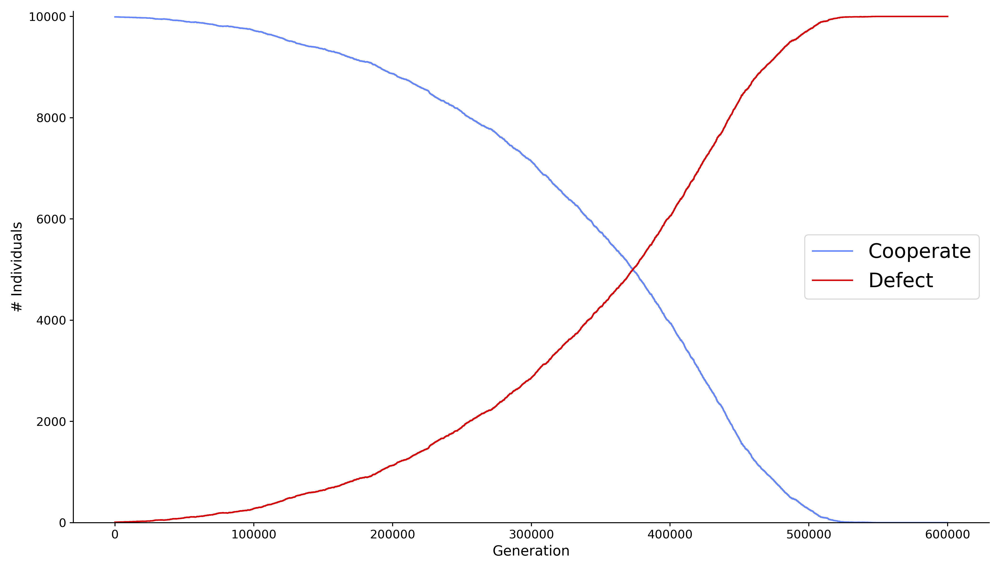
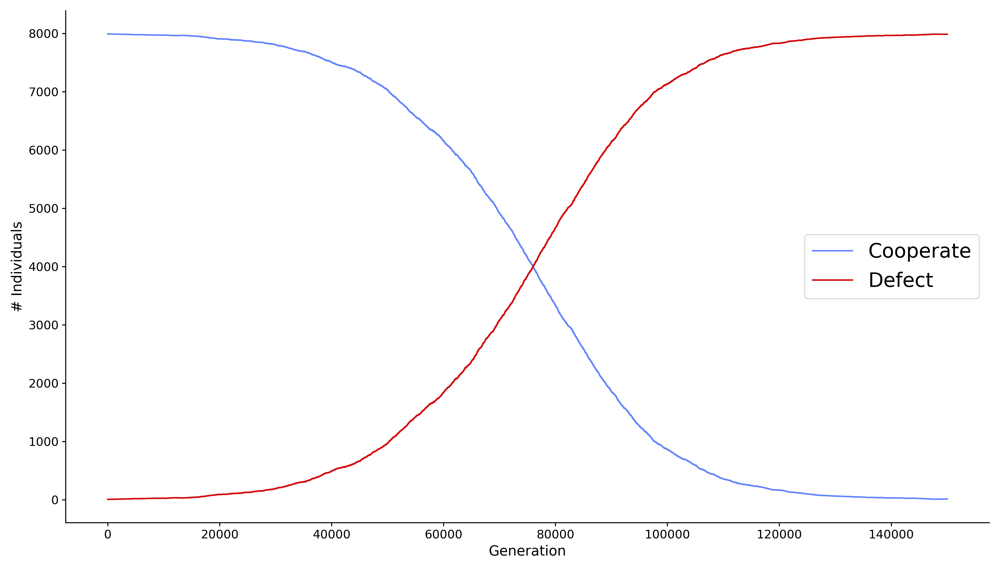

[](https://travis-ci.org/AngryMaciek/angry-moran-simulator)
[](https://coveralls.io/github/AngryMaciek/angry-moran-simulator?branch=master&kill_cache=1)
[](https://github.com/psf/black)
[](https://github.com/AngryMaciek/angry-moran-simulator/issues)
[](https://github.com/AngryMaciek/angry-moran-simulator/blob/master/LICENSE)
[](https://doi.org/10.21105/joss.02643)

# Moran [Py]cess



## Table of Contents

- [Moran [Py]cess](#moran-pycess)
  - [Table of Contents](#table-of-contents)
  - [General information](#general-information)
  - [Example results](#example-results)
    - [General Moran Model](#general-moran-model)
    - [Moran Model based on 2D neighbourhood](#moran-model-based-on-2d-neighbourhood)
    - [Moran Model based on 3D neighbourhood](#moran-model-based-on-3d-neighbourhood)
  - [Installation instructions](#installation-instructions)
    - [Download and install Miniconda](#download-and-install-miniconda)
    - [Clone the repository](#clone-the-repository)
    - [Build and activate a virtual environment](#build-and-activate-a-virtual-environment)
    - [Install the package](#install-the-package)
  - [Code documentation](#code-documentation)
  - [Contributing](#contributing)
  - [Contact](#contact)
  - [License](#license)

## General information

The following [git] repository presents a general game-theoretical framework to carry out scientific simulations according to the [Moran model]. Registering distinct types of individuals together with specification of payoffs between them allows to replicate evolution of the population and observe growth dynamics.

## Example results

### General Moran Model


> Simulations of population evolution according to four basic models of game theory: (A) Stag Hunt, (B) Chicken, (C) Prisoners Dilemma, (D) Rock-Paper-Scissors

### Moran Model based on 2D neighbourhood

Average payoff for an individual is calcualted based on interactions with 8 direct neighbours of a given individual (2D grid). Periodic boundary conditions are applied.


> Population snapshots during an evolution according to a Prisoners Dilemma model. Starting from a small subpopulation of Defectors (A, t=0) we observe gradual growth (B, t=50000), (C, t=200000) until the whole population is almost completely overtaken (D, t=500000).


> Growth curve for the population evolution according a Prisoners Dilemma model.

### Moran Model based on 3D neighbourhood

Average payoff for an individual is calcualted based on interactions with 26 direct neighbours of a given individual (3D grid). Periodic boundary conditions are applied.


> Growth curve for the population evolution according a Prisoners Dilemma model.

## Installation instructions

Our software is built as a [Python 3] package. Keeping research reproducibility in mind in this repository we provide a recipe for *conda* virtual environments which would contain all the required dependencies in their proper versions.  
We provide a YAML-formatted list of dependencies for the software execution [here](env/main.yml).  
We provide a YAML-formatted list of dependencies for the software development [here](env/dev.yml).  
Please inspect the files above for a detailed list of dependencies and their versions.

### Download and install Miniconda

To install the latest version of [miniconda] please execute:  
  
[Linux]:
```bash
wget https://repo.continuum.io/miniconda/Miniconda3-latest-Linux-x86_64.sh
bash Miniconda3-latest-Linux-x86_64.sh
source .bashrc
```

[macOS]:
```bash
wget https://repo.continuum.io/miniconda/Miniconda3-latest-MacOSX-x86_64.sh
bash Miniconda3-latest-MacOSX-x86_64.sh
source .bashrc
```

### Clone the repository

Please use git to clone this repository into a desired location (here: `moran-simulator`) with the following command:

```bash
git clone https://github.com/AngryMaciek/angry-moran-simulator moran-simulator
```

### Build and activate a virtual environment

Dedicated environment might be created and activated with the following commands:

```bash
cd moran-simulator
conda env create -f env/main.yml
conda activate moranpycess
```

### Install the package

Finally, please install our package into the new virtual environment with the [Python package manager]:

```bash
pip install .
```

## Code documentation

Inspect the documentation & how-to [here](documentation.md).

## Contributing

This project lives off your contributions, be it in the form of bug reports,
feature requests, discussions, or fixes and other code changes. Please refer
to the [contributing guidelines](CONTRIBUTING.md) if you are interested to
contribute. Please mind the [code of conduct](CODE_OF_CONDUCT.md) for all
interactions with the community.

## Contact

For questions or suggestions regarding the code, please use the
[issue tracker](https://github.com/AngryMaciek/angry-moran-simulator/issues).  

## License

MIT License

[Python 3]: https://www.python.org/download/releases/3.0/
[miniconda]: https://docs.conda.io/en/latest/miniconda.html
[git]: https://git-scm.com/
[Moran model]: <https://en.wikipedia.org/wiki/Moran_process>
[Python package manager]: <https://pypi.org/project/pip/>
