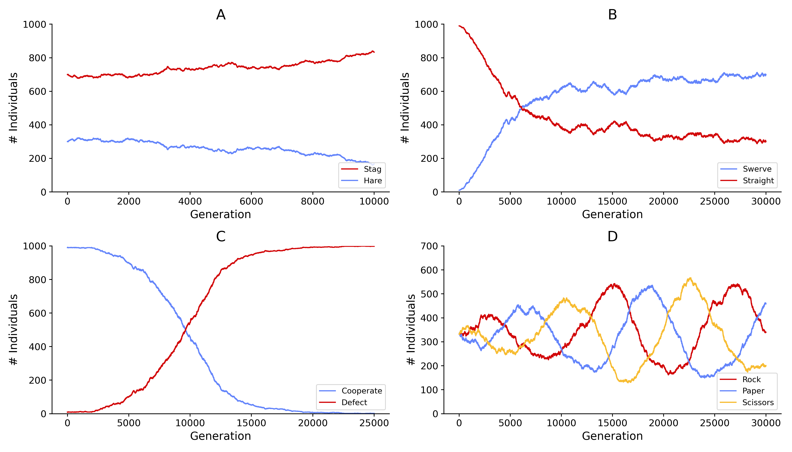

[](https://github.com/AngryMaciek/angry-moran-simulator/actions?query=workflow%3Abuild)
[](https://github.com/AngryMaciek/angry-moran-simulator/actions?query=workflow%3Apytest)
[](https://codecov.io/gh/AngryMaciek/angry-moran-simulator)
[](https://github.com/AngryMaciek/angry-moran-simulator/actions?query=workflow%3Aflake8)
[](https://github.com/psf/black)
[](https://www.codefactor.io/repository/github/angrymaciek/angry-moran-simulator)
[](https://github.com/AngryMaciek/angry-moran-simulator/actions?query=workflow%3Apublish)
[](https://pypi.org/project/moranpycess/)
[](https://anaconda.org/AngryMaciek/moranpycess)
[](https://mybinder.org/v2/gh/AngryMaciek/angry-moran-simulator/master?filepath=tests%2Fusecase.ipynb)
[](https://github.com/AngryMaciek/angry-moran-simulator/issues)
[](https://github.com/AngryMaciek/angry-moran-simulator/blob/master/LICENSE)
[](https://doi.org/10.21105/joss.02643)

# Moran [Py]cess


## Table of Contents

- [Moran [Py]cess](#moran-pycess)
  - [Table of Contents](#table-of-contents)
  - [General information](#general-information)
  - [Example results](#example-results)
    - [General Moran Model](#general-moran-model)
    - [Moran Model based on 2D neighbourhood](#moran-model-based-on-2d-neighbourhood)
    - [Moran Model based on 3D neighbourhood](#moran-model-based-on-3d-neighbourhood)
  - [Installation instructions](#installation-instructions)
    - [Download and install Miniconda](#download-and-install-miniconda)
    - [Clone the repository](#clone-the-repository)
    - [Build and activate a virtual environment](#build-and-activate-a-virtual-environment)
    - [Install the package](#install-the-package)
  - [Code documentation](#code-documentation)
  - [Contributing](#contributing)
  - [Contact](#contact)
  - [License](#license)

## General information

The following [git] repository presents a general game-theoretical framework to carry out scientific simulations according to the [Moran model]. Registering distinct types of individuals together with specification of payoffs between them allows to replicate evolution of the population and observe growth dynamics.

## Example results

### General Moran Model


> Simulations of population evolution according to four basic models of game theory: (A) Stag Hunt, (B) Chicken, (C) Prisoners Dilemma, (D) Rock-Paper-Scissors

### Moran Model based on 2D neighbourhood

Average payoff for an individual is calcualted based on interactions with 8 direct neighbours of a given individual (2D grid). Periodic boundary conditions are applied.


> Population snapshots during an evolution according to a Prisoners Dilemma model. Starting from a small subpopulation of Defectors (A, t=0) we observe gradual growth (B, t=50000), (C, t=200000) until the whole population is almost completely overtaken (D, t=500000).


> Growth curve for the population evolution according a Prisoners Dilemma model.

### Moran Model based on 3D neighbourhood

Average payoff for an individual is calcualted based on interactions with 26 direct neighbours of a given individual (3D grid). Periodic boundary conditions are applied.


> Growth curve for the population evolution according a Prisoners Dilemma model.

## Installation instructions

### Install from Python Package Index

The easiest way to install our Python package in the current environment is via the `pip` command (requires internet connection):
```bash
pip install moranpycess
```

All of the dependencies will be installed alongside automatically. Their versions are specified in the [setup configuration file](setup.cfg).

### Install from Anaconda Cloud

Alternatively, if one uses _conda_ package manager, the software might be installed directly from Anaconda servers with:
```bash
conda install -c angrymaciek moranpycess
```

And again, the dependencies are taken care of by the package manager.  
Please beware that this installation method requires `conda>=4.3` version.

## Code documentation

Inspect the documentation & how-to [here](documentation.md).

## Contributing

This project lives off your contributions, be it in the form of bug reports,
feature requests, discussions, or fixes and other code changes. Please refer
to the [contributing guidelines](CONTRIBUTING.md) if you are interested to
contribute. Please mind the [code of conduct](CODE_OF_CONDUCT.md) for all
interactions with the community.

## Contact

For questions or suggestions regarding the code, please use the
[issue tracker](https://github.com/AngryMaciek/angry-moran-simulator/issues).  

## License

MIT License

[miniconda]: https://docs.conda.io/en/latest/miniconda.html
[git]: https://git-scm.com/
[Moran model]: <https://en.wikipedia.org/wiki/Moran_process>
[Python package manager]: <https://pypi.org/project/pip/>
