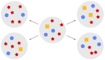

# Moran [Py]cess

## General information

The following Python package presents a general game-theoretical framework to carry out scientific simulations according to the [Moran model]. Registering distinct types of individuals together with specification of payoffs between them allows to replicate evolution of the population and observe growth dynamics.

For more information please visit the [project's homepage].

[miniconda]: https://docs.conda.io/en/latest/miniconda.html
[Moran model]: <https://en.wikipedia.org/wiki/Moran_process>
[Python package manager]: <https://pypi.org/project/pip/>
[project's homepage]: <https://angrymaciek.github.io/angry-moran-simulator/_build/html/index.html>
