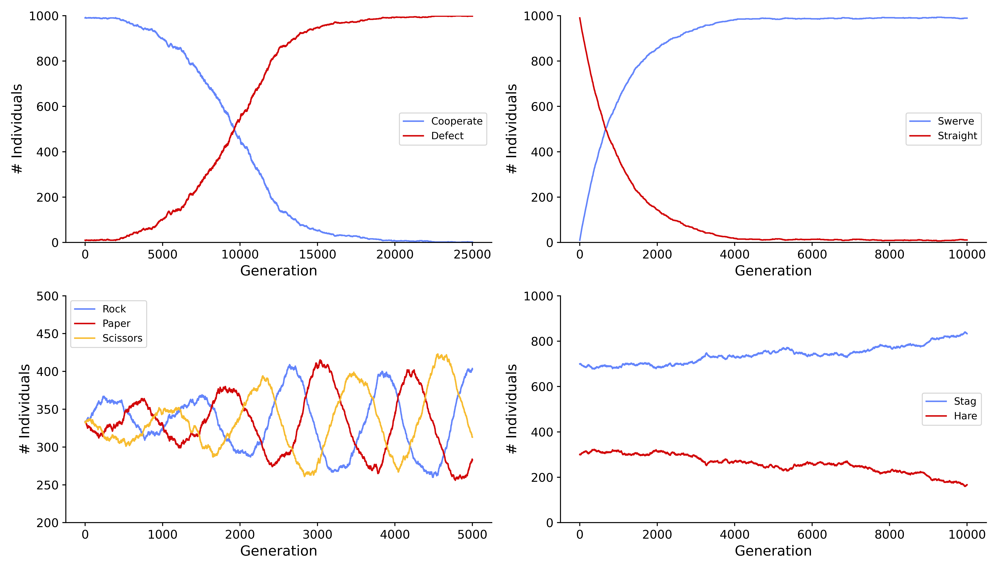

# Introduction

Population is created by individuals of the same species living simultaneously on a shared area and related to each other by a complex system of mutual dependencies.
Population characteristics, including: reproduction, mortality, abundance or life strategy change over time under the influence of evolutionary mechanisms. Complicated network of interactions with several degrees of freedom is very challenging for evolutionary biologists to decode. A simple mathematical model proposed by Patrick Moran is often used to describe probabilistic dynamics of a finite population of constant size `[@Moran:1958]`. Within this framework, each individual might be assigned with a fitness score calculated solely based on the scored interactions with all the other members of the group. Fitness drives the probability of an individual to reproduce while mutual interaction scores are calculated according to a common ‘payoff matrix’, treating the whole system as a game. In many populations the emergence of evolutionary stable strategy (EES) is observed. ESS complements Nash's equilibrium with an additional stability condition. A strategy is considered as evolutionary stable if it is resistant to an invasion of a small group with a different phenotype and cannot be overtaken `[@Smith:1982]`. Evolutionary game theory set grounds 
for a solid framework for quantitative population biology, allowing researchers 
to simulate dynamics and estimate trajectories of biological systems.

# Statement of need 

We have developed a Python package with a general game-theoretical framework for scientific simulations according to the Moran model. Contrary to cellular automata, the following approach allows the stochastic nature of evolution to be preserved. We chose Python because of its availability and popularity in the fields of bioinformatics and data analysis. In principle, such simulations could be recreated within DEAP - a framework dedicated to genetic and evolutionary algorithms `[@Fortin:2012]`. However, Moran Pycess is capable of carrying out simulations over 2D and 3D grid where individuals consider their direct neighbours - a task which would not be straightforward in DEAP. Three-dimensional space is particularly important for modeling dynamics of population growth in cell biology `[@Macnamara:2020]`. Moreover, due to its complexity, DEAP is more suitable for users with good software engineering skills. In contrast, the strength of Moran Pycess lays in its simplicity which turns it into a useful research aid for evolutionary and computational biologists. Open source license as well as its accessibility endorse Moran Pycess as a practical tool for biology, economics and math students to learn about population evolution based on game theory or for computer science students aiming to properly encapsulate their research software. A remarkable  advantage of our module is that any possible model of a game may be considered. This is not the case for another powerful Python package - Axelrod - which allows to model evolution of cooperation in various strategies, but is limited to Prisoners’ Dilemma only `[@axelrodproject:2016]`. In terms of quality assurance: our repository incorporates Travis CI mechanism alongside Coveralls code coverage measurement (currently: 100%).

#  Example results

We have designed four distinct systems based on well-known interaction examples which have been vastly described in the literature `[@Tadelis:2012]`.

(A) The stag hunt model describes a conflict between safety and social cooperation: hare -  small but certain profit, stag - great benefit but adventurous. Failure in cooperation leads to a player’s loss. There is no dominant strategy in this game as it is most beneficial for individuals to agree on the same strategy. Both stag hunt and hare hunt are considered as an ESS. A perfect example of this type of interaction is the “carousel feeding” as a cooperative hunting method used by Norwegian orcas which force the school of fish to form a tight ball, then stun fish with their tails `[@Fort:2007]`.

(B) In the game of Chicken a confrontational strategy brings the greatest profit. However, if chosen by both individuals it yields the worst outcome. A peace strategy protecting against the greatest loss brings no reward. No player has a dominant strategy. There is no ESS in pure strategies in this game. Consider an example of two strains of the yeasts S. cerevisiae: wildtype - using invertase to produce monosaccharides and a mutant lacking the invertase gene - consuming glucose without bearing the metabolic cost. Under certain conditions wildtype cells competition against always-defecting cells results in wildtype cells cooperation in invertase expressing. Invertase expression is repressed while competing against an always-cooperating strain causing the wildtype cell to cheat `[@Gore:2009]`.

(C) Prisoners’ dilemma, often analyzed in game theory due to its multiple applications, presents a case where two completely rational individuals might not cooperate, even if it appears that it is in their best interests to do so. The most rational strategy yields the worst collective outcome. Every participant has a dominant strategy. The only EES is to always cooperate. In biological context the prisoner’s dilemma successfully captures the essential features of cancer growth and allows to test hypotheses and formulate claims in a quantitative manne `[@West:2016]`. In the case of malignant tumors, we observe the possibility of infiltration of adjacent tissues by cancer cells. Their characteristic uncontrolled proliferation leads to the growth of another tumor in this place and the destruction of healthy tissue.

(D) Rock-paper-scissors is a game with cyclic dominance resulting in an oscillating number of individuals of a given type. There is no EES in this game. Remark the case of the side-blotched lizard. The male lizards come in three color morphs: orange, yellow, and blue. The orange males defend large territories. The yellow males invade orange males territories. The blue male effectively expels yellow males from their territory but are outcompeted by aggressive orange meles `[@Sinevro:1996]`. As a result: yellow beats orange, which bests blue which beats yellow.

# References

